# 🍔 BiteBuddy — Full-Stack Food Delivery Web Application

BiteBuddy is a modern full-stack food delivery web application built to provide a smooth food-ordering experience for customers and a powerful management system for administrators.

The project includes a responsive customer website and a dedicated Admin Panel for managing food items, categories, users, orders, stock, notifications, and business information.

---

## 🌐 Live Demo

### 👤 Customer Website
**Live Demo:** `LIVE_DEMO_URL`

### 🔐 Admin Panel
**Admin Panel:** `ADMIN_PANEL_URL`


---

## 🔐 Admin Panel Demo Access

Recruiters / HR can explore the BiteBuddy Admin Panel using the **Demo Admin account**.

### Demo Credentials

```text
Email: demo@bitebuddy.com
Password: Demo@12345
```

### 👨‍💼 Recruiter / HR Flow

```text
Open Admin Panel
       ↓
Admin Login
       ↓
Enter Demo Credentials
       ↓
Demo Admin Authentication
       ↓
Admin Dashboard
       ↓
Explore Products / Categories / Orders / Users
```
    Note: The demo account is created for portfolio/recruiter access. It cannot perform destructive or sensitive operations such as adding, editing, or deleting production data.
---

## ✨ Features

### 👤 Customer Features

* User registration and login
* Browse food products
* Browse food by categories
* Search food items
* Filter and sort products
* View food details
* Add food items to cart
* Update cart quantity
* Remove items from cart
* Place orders
* Cash on Delivery and online payment
* View order history
* Responsive design for mobile, tablet, and desktop

### 🛠️ Admin Features

* Admin authentication
* Admin dashboard
* Product management
* Category management
* User management
* Order management
* Payment management
* Search products, users, and orders
* Out-of-stock food management
* Order status management
* Revenue and order statistics
* Notifications  

---

## 💳 Online Payment Demo

BiteBuddy uses Razorpay Test Mode for online payment.

No real money is charged during test transactions.

For testing online payments, use Razorpay's official Test Mode card/UPI details.

> Real debit/credit card details will not work in Test Mode.
---

## 🛡️ Role-Based Admin Access

BiteBuddy uses role-based access control for the Admin Panel.

### 👑 Real Admin

```text
Role: admin
```

The Real Admin has full access to administrative operations.

- Manage products
- Manage categories
- Manage users
- Manage orders
- Manage payments
- Manage settings
- Perform add/edit/delete operations

### 👀 Demo Admin

```text
Role: demoAdmin
```

The Demo Admin is designed specifically for recruiters and portfolio visitors.

It can explore important Admin Panel sections but cannot perform sensitive or destructive operations.

---

## 🛠️ Tech Stack

### Frontend

- React.js
- Vite
- React Router
- JavaScript
- HTML5
- CSS3
- Axios

### Backend

- Node.js
- Express.js
- REST API
- JWT Authentication
- bcrypt
- Multer
- CORS
- dotenv

### Database & Services

- MongoDB
- Mongoose
- Cloudinary
- Razorpay

---

## 🔐 Authentication & Security

- Separate customer and admin authentication
- JWT-based admin authentication
- HTTP-only authentication cookie
- Password hashing with bcrypt
- Protected admin routes
- Role-based authorization
- Demo Admin restrictions
- Backend-level permission checks
- Environment variables for sensitive configuration
- CORS configuration

The Admin Panel is protected at both the frontend and backend levels. Even if a restricted Demo Admin attempts a protected API operation directly, the backend rejects the request.

---


## 📸 Screenshots

### 👤 Customer Website

#### 🏠 Home
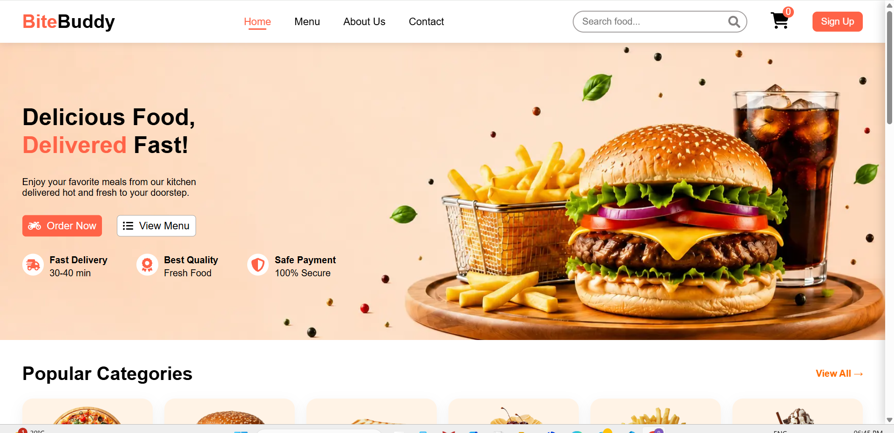

#### 🍕 Menu
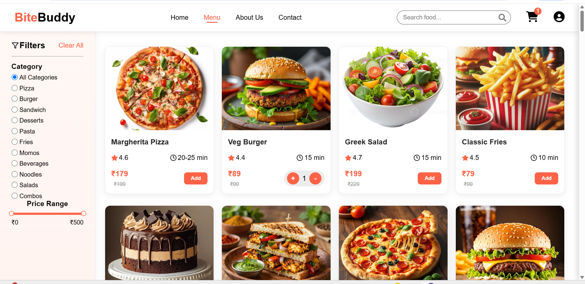

#### 🍔 Product Details
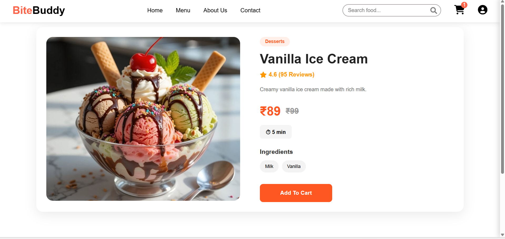

#### 🛒 Cart
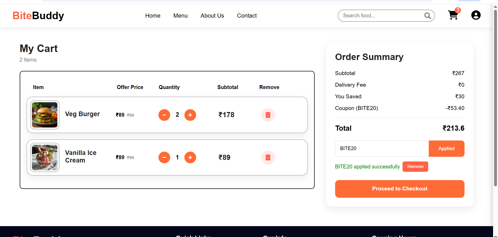

#### 💳 Checkout
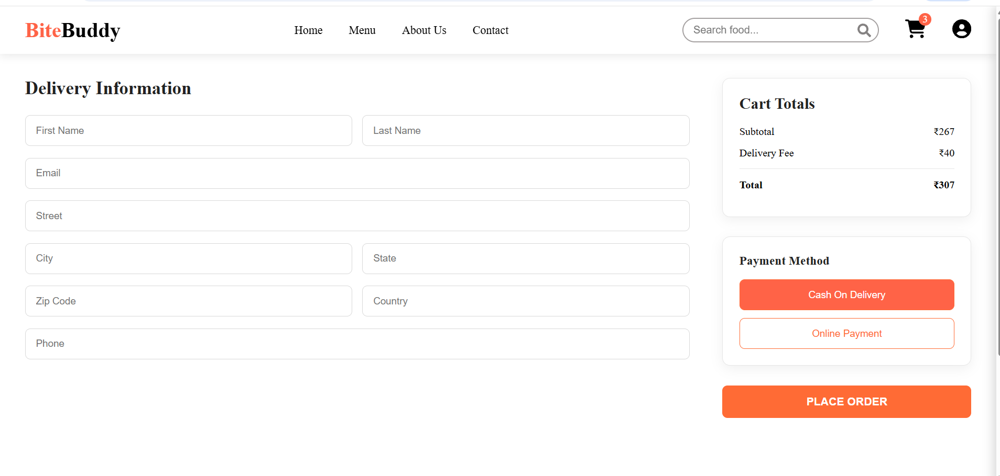

---

### 🔐 Admin Panel

#### 📊 Dashboard
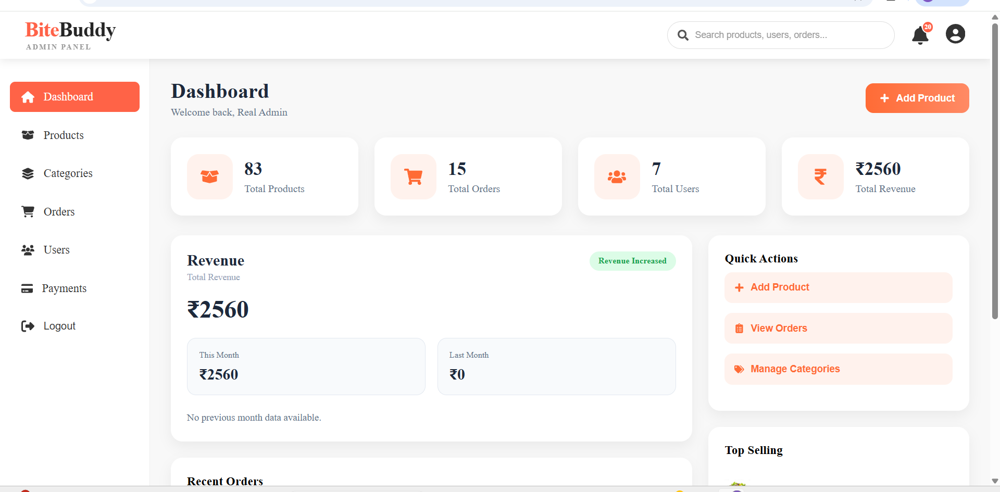

#### 🍔 Products
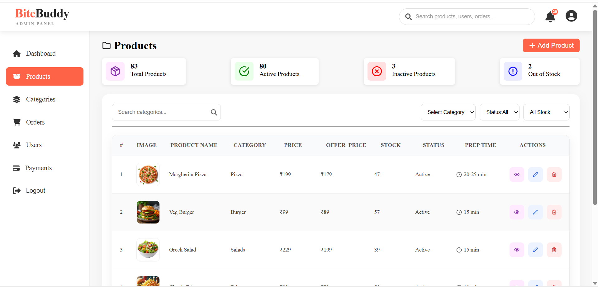

#### 📂 Categories
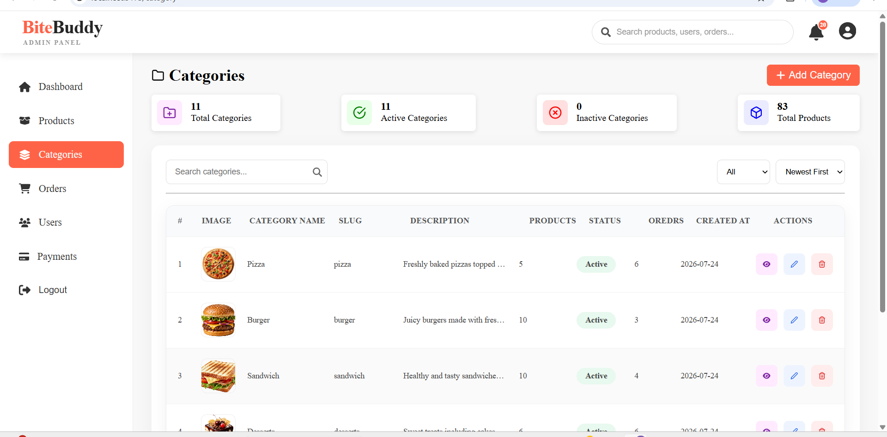

#### 👤 Users
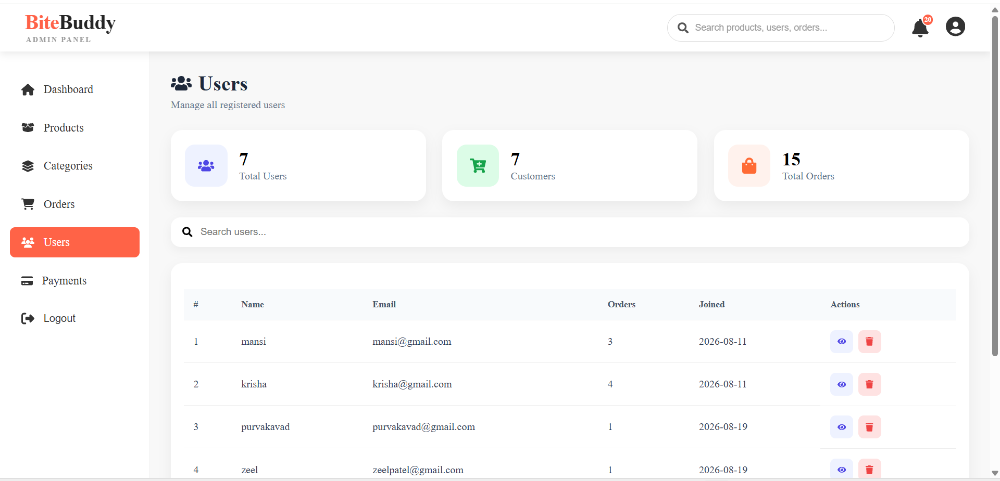

#### 📦 Orders
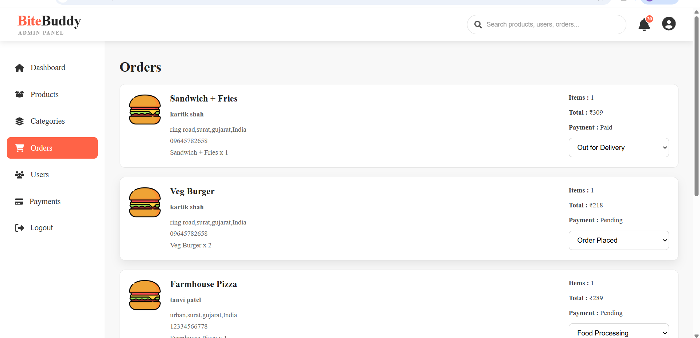

#### 💳 Payments
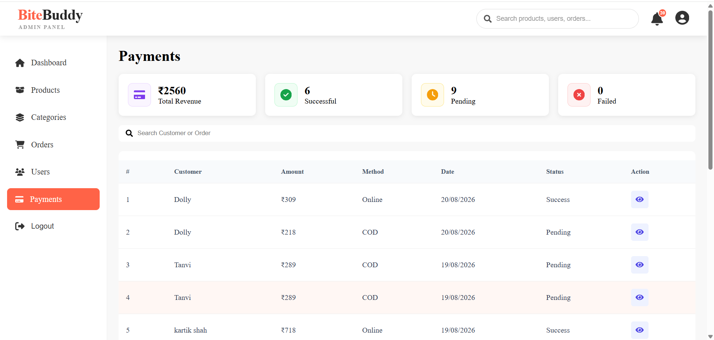

---

## 📁 Project Structure

```text
BiteBuddy/
│
├── Backend/
│   ├── config/
│   ├── controllers/
│   ├── Midllerware/
│   ├── models/
│   ├── routes/
│   └── server.js
│
├── Frontend/
│   ├── Admin/
│   │   ├── public/
│   │   └── src/
│   │
│   └── BiteBuddy/
│       ├── public/
│       └── src/
│
├── screenshots/
│
├── .gitignore
└── README.md
```

---

## 🚀 Deployment

BiteBuddy is designed as a full-stack application with separate frontend, backend, database, image storage, and payment integration.

### Deployment

```text
Customer Frontend → FRONTEND_HOSTING
Admin Panel       → ADMIN_HOSTING
Backend API       → BACKEND_HOSTING
Database          → MongoDB
Images            → Cloudinary
Payments          → Razorpay
```
---

## ⚙️ Environment Variables

Sensitive credentials should never be committed to GitHub.

Examples of sensitive configuration include:

```text
MongoDB connection
JWT secret
Cloudinary credentials
Razorpay keys
Backend URLs
```

These should be stored in environment variables and excluded using `.gitignore`.

---


## 👨‍💻 Developer

### Purva Kavad

**BCA Student | Aspiring Full-Stack Web Developer**

Interested in developing modern, responsive and user-friendly web applications using technologies such as React.js, Node.js, Express.js and MongoDB.

---

## ⭐ Project

If you find BiteBuddy interesting, consider giving the repository a ⭐ on GitHub.

---

## 📄 License

This project is created for educational, learning and portfolio purposes.
